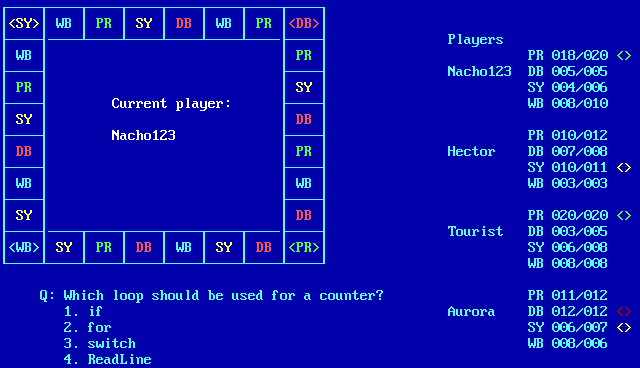

# Console Trivial

## Version 01: Load and answer questions

You must create a text, with questions belonging to 4 categories (Programming, 
Databases, Systems, Web). For each question there will be: text, category, 4 
possible answers, number of the correct answer. The content will be loaded from 
the file at the beginning of each game session.

When starting a game, the number of players (up to a maximum of 4) and the name 
of each player will be asked. A game session will start, in which, each turn, a 
question will be chosen at random and it will be shown to the player who has 
the turn. Their answer will be taken and checked. Even if successful, the turn 
will always change to the next player. Each successfully answered question will 
add a point. The game will end when one player has 20 points.

The game will finally (after several versions) look similar to this:

The interface can be in Spanish or English, but the source (names of variables, 
comments, etc) must be in English.

The classes structure is not important yet, because that will be formalized in a 
later version.

---

## Entrega 01: Cargar y responder preguntas

Se creará un fichero de texto con algunas preguntas pertenecientes a 4 
categorías (Programming, Databases, Systems, Web). Para cada pregunta habrá: 
enunciado, categoría, 4 posibles respuestas, número de la respuesta correcta. 
El contenido se cargará desde fichero al principio de cada sesión de juego. 

Al comenzar una partida, se preguntará la cantidad de jugadores (hasta un 
máximo de 4) y el nombre a cada jugador. Comenzará una sesión de juego, en la 
que en cada turno se escogerá una pregunta al azar y se le mostrará al que 
tenga el turno. Se tomará su respuesta y se comprobará si ha acertado. Aunque 
haya acertado, el turno siempre cambiará de jugador.  Cada pregunta acertada 
sumará un punto, y las equivocadas no restarán. Se repetirá hasta que una ronda 
termine y un jugador tenga 20 puntos.

La apariencia final, hacia la que te irás acercando en sucesivas aproximaciones será algo como:

El interfaz puede estar en castellano o en inglés, pero el fuente (nombres
de variables, comentarios, etc) debe estar en inglés.

Todavía no es importante la estructura de clases, porque eso se formalizará
en una entrega posterior.
