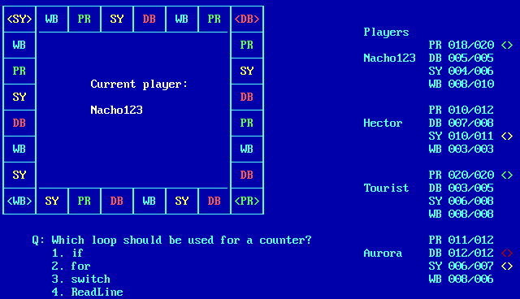

# Console Trivial

## Version 04: Real game, part 1

When the user chooses a square to move to (after rolling the dice), a random 
question from to the chosen category will be displayed, together with its 
possible 4 answers. The user can choose an answer (by pressing 1 to 4, or A to 
D, as you choose) and they will be told if they have guessed right or not.

The question and the answers should appear at the bottom of the
screen, as shown in the example screen.

Then the turn will go to the next player, and so on until finish the game 
because one of the players reaches 20 or more points, but with a difference of 
2 over the others (a final score like 20 15 14 19 will not be valid, in which 
the first player has 20 points and the fourth has 19, and, in that case, the 
game must continue with another round).

The game can be interrupted by pressing ESC (confirmation must be requested).

---

## Entrega 04: Juego real, parte 1

Cuando escoge una casilla a la que moverse (tras lanzar el dado), se mostrará 
una pregunta al azar correspondiente a la categoría escogida, junto con sus 
posibles 4 respuestas. El usuario podrá elegir una respuesta (pulsando 1 a 4, o 
A a D, según el criterio que elijas) y se le dirá si ha acertado o no.

La pregunta y las respuestas deben aparecer en la parte inferior de la 
pantalla, como indicaba la pantalla de ejemplo.

Después pasará el turno al siguiente jugador, y asi sucesivamente hasta que 
termine la partida porque uno de los jugadores alcance 20 puntos o más, con una 
diferencia de 2 sobre los demás (no será válida una puntuación final como 20 15 
14 19, en que el primer jugador tiene 20 puntos y el cuarto tiene 19, y en ese 
caso se deberá seguir con otra ronda).

Se podrá interrumpir la partida pulsando ESC (se deberá pedir confirmación).
