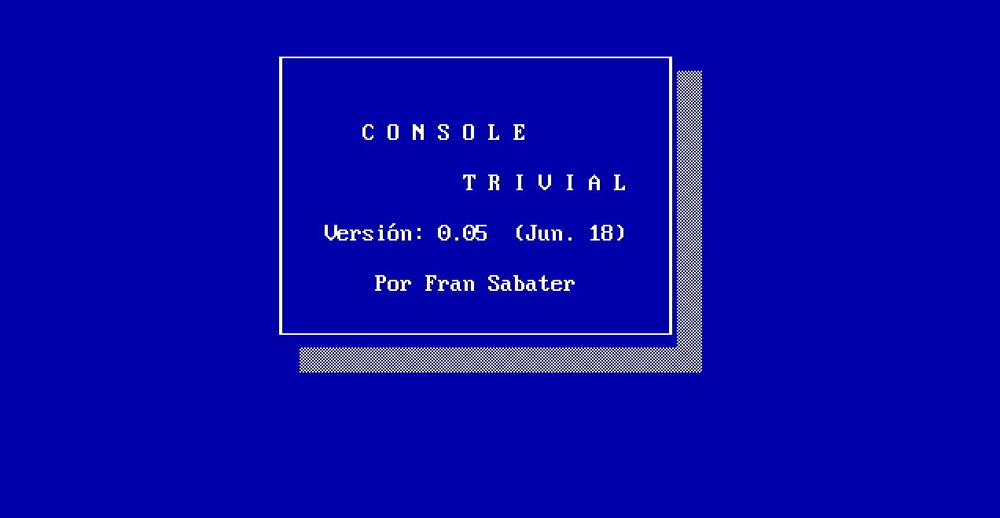

# Console Trivial

## Version 05: Classes structure

The main class will be ConsoleTrivial, and will act as coordinator of the other 
classes. It will have a single public method Run, not static, as well as Main.

There will be a WelcomeScreen class (also with only a Run method, not static). 
At the beginning of the session, the presentation screen should appear, similar 
to the example shown, which will be kept for 5 seconds (or less, if a key is 
pressed).

Each question will be in a class Question class, with properties similar to 
what until now were fields of a struct.

The list of questions will be in a class ListOfQuestions. This class will have 
a method"Get (n)", which will return the question in a certain position, a 
property "Amount" to return the number of existing questions and a method "Add" 
to add a question to the end of the existing data structure. You must also 
create a "Load" method that loads all your data from file (and calls "Add" to 
insert those data). You must also have a "GetFromCategory(c)" method that will 
get a random question of a certain category and a "GetFromCategoryNR(c)" that 
will get a not-used random question  (until all have been used, of course) of a 
certain category .

The data should be in a file called "questions.dat", in the same folder as the 
executable (and not duplicated).

There will be a class Player to represent each player and their status 
(position, color, number of answers attempted and successful in each category).

A class Board will take care of drawing the board on screen, using a Draw 
method.

The class Game, also with its Run method, will be the one to focus on the logic 
of a game session, delegating, when appropriate, in Player, Board and 
ListOfQuestions.

---

## Entrega 05: Estructura de clases.

La clase ConsoleTrivial será la principal, y actuará como coordinadora de las 
demás clases. Tendrá un único método público Run, no estático, así como Main.

Existirá una pantalla de presentación, en la clase WelcomeScreen (también con 
un único método Run, no estático). Al comenzar la sesión, debe aparecer dicha 
pantalla de presentación, parecida al ejemplo que se muestra, que se mantendrá 
durante 5 segundos (o menos, si se pulsa antes alguna tecla).

Cada pregunta estará en una clase Question, con propiedades para representar lo 
que hasta ahora eran campos de un struct.

La lista de preguntas estará en una clase ListOfQuestions. Esta clase tendrá un 
método "Get(n)", que devuelva la pregunta que hay en una cierta posición, una 
propiedad "Amount" que devuelva la cantidad de preguntas existentes y un método 
"Add(pregunta)" que añada una pregunta al final de la estructura de datos 
existente. También deberá tener un método "Load" que cargue todos sus datos 
desde fichero (y que llame a "Add"). También tendrá un método 
"GetFromCategory(c)" que obtendrá una pregunta al azar de una cierta categoría 
y un "GetFromCategoryNR(c)" que obtendrá una pregunta al azar no repetida 
(hasta que se hayan usado todas, claro) de una cierta categoría.

Los datos deberán estar en un fichero llamado "questions.dat", en la misma 
carpeta que el ejecutable (y no duplicados).

Existirá una clase Player para representar a cada jugador y su estado 
(posición, color, cantidad de respuestas intentadas y acertadas en cada 
categoría).

Del dibujado del tablero se encargará una clase Board, con un método Draw.

La clase Game, también con su método Run, será la que absorba la lógica de una 
sesión de juego, delegando, cuando corresponda, en Player, Board y 
ListOfQuestions.

